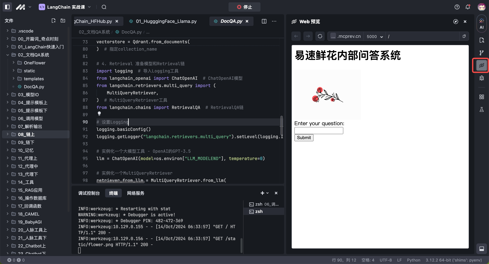

# AI 练中学

欢迎使用 MarsCode - AI 练中学功能，这是掘金[《LangChain 实战课》](https://juejin.cn/book/7387702347436130304?utm_source=course_list)的配套项目空间，项目中已经安装好了课程依赖的软件环境并预置了 10k 限额的免费豆包API，课程代码可以一键执行！您也可以前往火山引擎平台注册账号，新用户即有 50w 每模型的免费调用额度。

# Quick Start
在文件树中打开 `00_开篇词_奇点时刻/01_SimpleTextGeneration.py` 文件，点击执行按钮、即可运行代码获取大模型返回的结果。
  

# 使用说明

1. 打开课程代码，单击 **运行** 按钮执行程序。
  

2. 单击侧边栏中的 **调试** 按钮进入调试界面。
  

3. 单击侧边栏中的 **Web预览** 可查看实时页面。
  

4. **AI助手** 支持智能问答，你可以向其提问课程代码相关的问题
  


更多介绍：

  - **默认运行配置**：MarsCode 为您提供了一个默认的运行配置：运行Current File。你可以更改 **. vscode/launch.json** 中的配置。参考 [Visual Studio Code 的文档](https://code.visualstudio.com/docs/editor/debugging) 有关如何配置 launch.json。
  - 更多关于MarsCode的使用方法，请参考[MarsCode用户文档](https://docs.marscode.cn/docs/introduction-to-marscode-ide)。
  - 欢迎下载[MarsCode插件](https://www.marscode.cn/?utm_source=ai_learning&utm_medium=readme&utm_campaign=)，在本地VS Code / IntelliJ IDEA中使用AI助手。
  


# 注册豆包API账号

1. 访问[火山方舟官网](https://console.volcengine.com/ark/region:ark+cn-beijing/model)完成账号注册和服务授权 
2. 在控制台的 **API Key管理** 页面中创建 API Key。

3. 在控制台的 **在线推理页面** 中创建推理接入点，推荐使用**doubao-pro-32k**作为主力模型，模型部署完成后即可获得模型的base_url和model_endpoint 
4. 编辑项目中的 **/home/cloudide/.cloudiderc** 文件，将API_Key、base_url、model_endpoint 配置在环境变量中，在命令行中执行 `source ~/.cloudiderc` ，之后就都可以使用自己豆包模型API执行课程代码。
```
export OPENAI_API_KEY=<YOUR_API_KEY>
export OPENAI_BASE_URL=<YOUR_MODEL_BASE_URL>
export LLM_MODELEND=<YOUR_MODEL_ENDPOINT>
```


# 帮助

如果你需要帮助，你可以查看[文档](https://docs.marscode.cn/)；也欢迎您随时向我们提供[反馈](https://juejin.cn/pin/club/7359094304150650889?utm_source=doc&utm_medium=marscode)。
